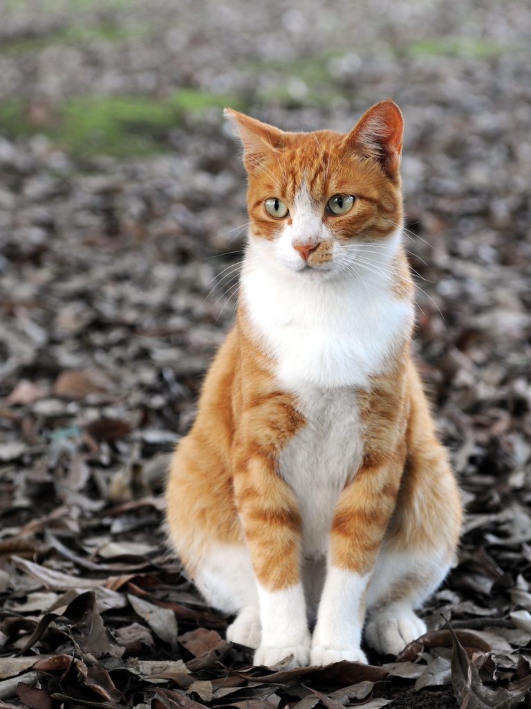

# PyGFWX

A Python implementation of the GFWX (Good, Fast Wavelet Codec) for educational purposes.



*Test image: "Orange tabby cat sitting on fallen leaves" by [Hisashi](https://commons.wikimedia.org/wiki/File:Orange_tabby_cat_sitting_on_fallen_leaves-Hisashi-01A.jpg) (derivative work: Caspian blue), [CC BY-SA 2.0](https://creativecommons.org/licenses/by-sa/2.0/)*

## Overview

PyGFWX is an educational implementation of the [GFWX wavelet codec](https://www.gfwx.org/), created to learn and understand wavelet-based image compression. The implementation prioritizes **readability over performance** - it's written in pure Python with NumPy for data structures, but no optimized libraries for the core algorithms.

> **Note:** This is a learning tool, not a production codec. For high-performance encoding, use the [reference C++ SDK](https://www.gfwx.org/). PyGFWX is useful for understanding how wavelet compression works, experimenting with the algorithm, and educational purposes.

### Compression Demo

Using the cat image above (768×1024 RGB), here are compression results at different quality levels:

| Quality | Compressed Size | Compression Ratio | PSNR |
|---------|-----------------|-------------------|------|
| 64 (high compression) | 64 KB | 36:1 | 37.4 dB |
| 256 (medium) | 246 KB | 9.4:1 | 43.9 dB |
| 512 (high quality) | 483 KB | 4.8:1 | 47.6 dB |
| 1024 (lossless) | 847 KB | 2.7:1 | ∞ |

*Original uncompressed size: 2.25 MB (768×1024×3 bytes)*

### Features

- **Wavelet compression** using lifting scheme (5/3 and 9/7 wavelets)
- **Golomb-Rice entropy coding** with context-adaptive modeling
- **Progressive decoding** with downsampling support
- **Multiple color modes**: Mono, RGB, RGBA, Bayer patterns
- **Quality range**: Lossy (1) to lossless (1024)
- **Multi-layer support**: Stereo images, depth maps, animation frames
- **Custom color transforms**: Programmable UYV, A710, and custom transforms
- **Metadata support**: JSON, key-value, or binary metadata blocks

### Why Pure Python?

This project implements the full codec in readable Python to make it easy to:

- **Step through** the compression pipeline with a debugger
- **Understand** each stage: wavelets, quantization, entropy coding
- **Experiment** with modifications to the algorithm
- **Learn** wavelet compression without deciphering optimized C++

The code is validated against the reference SDK to ensure correctness, but runs significantly slower (expect 100x+ slower than the C++ implementation).

## Installation

This project uses [uv](https://docs.astral.sh/uv/) for dependency management.

```bash
# Clone the repository
git clone https://github.com/chiplukes/pygfwx.git
cd pygfwx

# Install dependencies
uv sync

# Install with development dependencies
uv sync --all-extras
```

## Quick Start

```python
from pygfwx import encode, decode
import numpy as np

# Create or load an image (numpy array)
image = np.random.randint(0, 256, (256, 256), dtype=np.uint8)

# Encode (compress)
compressed = encode(image, quality=512)

# Decode (decompress)
decoded = decode(compressed)

# Verify
assert np.array_equal(image, decoded)  # True for lossless (quality=1024)
```

## Project Structure

```
pygfwx/
├── src/pygfwx/          # Main Python package
│   ├── core/            # Core codec implementation
│   │   ├── bitstream.py     # Bit-level I/O
│   │   ├── header.py        # GFWX header parsing
│   │   ├── lifting.py       # Wavelet transforms
│   │   ├── golomb_rice.py   # Entropy coding
│   │   ├── context.py       # Context modeling
│   │   ├── encoder.py       # Coefficient encoding
│   │   ├── decoder.py       # Coefficient decoding
│   │   ├── transforms.py    # Color transforms
│   │   ├── bayer.py         # Bayer/RAW support
│   │   ├── multi_layer.py   # Multi-layer images
│   │   └── metadata.py      # Metadata utilities
│   ├── streaming/       # Progressive/streaming support
│   └── utils/           # Helper functions
├── cross_codec/         # SDK wrapper and validation tools
├── tests/               # Test suite (356+ tests)
├── examples/            # Example scripts
├── notes/               # Documentation
└── gfwx-sdk/            # Reference C++ SDK
```

## Documentation

- [Compression Overview](notes/compression_overview.md) - How GFWX compression works
- [Bitstream Format](notes/bitstream.md) - GFWX file format specification
- [Lifting Scheme](notes/lifting_scheme.md) - Wavelet transform details
- [Golomb-Rice Coding](notes/golomb_rice.md) - Entropy coding explanation
- [Project Plan](notes/pygfwx_project_plan.md) - Development roadmap

## Running Tests

```bash
# Run all tests
uv run pytest

# Run with coverage
uv run pytest --cov=pygfwx

# Run specific test file
uv run pytest tests/test_bitstream.py

# Run SDK comparison tests (requires built SDK)
uv run pytest -m sdk
```

## Development

### Code Quality

```bash
# Check linting
uv run ruff check src tests

# Format code
uv run ruff format src tests
```

### Building the SDK

The reference SDK is needed for validation tests:

```bash
cd gfwx-sdk/build
cmake ..
cmake --build . --config Release
```

## Quality Levels

| Quality | Description | Use Case |
|---------|-------------|----------|
| 1-64 | High compression | Thumbnails, previews |
| 64-256 | Medium-high | Web images |
| 256-512 | Medium | General photography |
| 512-1000 | Low compression | High quality |
| 1024 | Lossless | Archival, masters |

## How It Works

GFWX uses a wavelet-based compression pipeline:

1. **Color Transform** - Convert RGB to decorrelated color space (UYV)
2. **Wavelet Transform** - Apply lifting-based wavelet decomposition
3. **Quantization** - Scale coefficients based on quality setting
4. **Entropy Coding** - Golomb-Rice coding with context modeling

```
┌─────────┐    ┌─────────┐    ┌────────┐    ┌─────────┐
│  Image  │ -> │  Color  │ -> │Wavelet │ -> │Quantize │ -> ┌──────────┐
│  RGB    │    │Transform│    │ Lift   │    │ Scale   │    │ Entropy  │
└─────────┘    └─────────┘    └────────┘    └─────────┘    │  Code    │
                                                           └────┬─────┘
                                                                │
                                                                v
                                                         ┌──────────┐
                                                         │Compressed│
                                                         │  Data    │
                                                         └──────────┘
```

## References

- [GFWX Website](https://www.gfwx.org/)
- [GFWX Whitepaper](https://www.gfwx.org/gfwx.pdf)
- [Reference SDK](https://github.com/kalcutter/gfwx)

## License

BSD 3-Clause License (same as GFWX)

## Acknowledgments

- Graham Fyffe for creating GFWX
- USC Institute for Creative Technologies
- GFWX is "thoroughly tested using several pictures of cats" 🐱

---

*This is an educational project focused on understanding wavelet-based image compression.*
